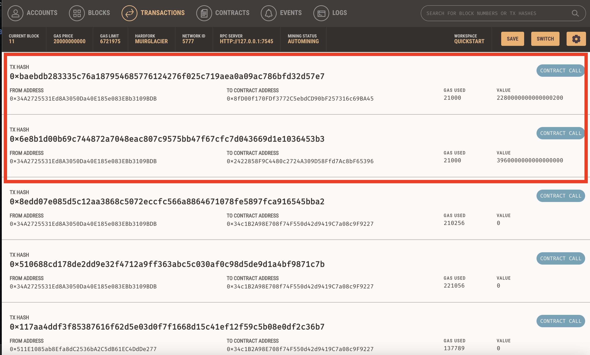

# Fintech Finder: Challenge 19

Fintech Finder is an application that its customers can use to find fintech professionals from among a list of candidates, hire them, and pay them.

The task was to integrate the Ethereum blockchain network into this app. Doing do will allow the opportunity for our customers to instantly pay the hired fintech profressionals for their services with cryptocurrency. 

Here is a screenshot of the the two recent paid fintech professionals. They each worked a 12 hour period. 

